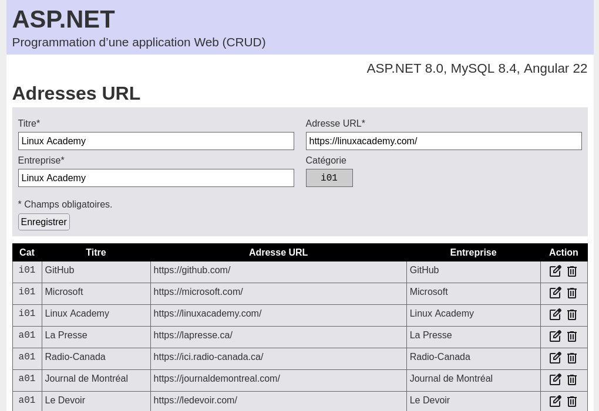

# aspnet-e08 &mdash; Programmation d’une application Web (CRUD)


## Création des fichiers ASP.NET Web API
À partir du dossier `aspnet-e08`, exécuter les commandes suivantes :
```sh
cd aspnet-e08
dotnet new webapi -n aspnet08
cd aspnet08
dotnet new gitignore
```

## Création des fichiers Angular 22
À partir du dossier `aspnet-e08`, exécuter les commandes suivantes :
```sh
ng new angular08
```
Au cours de la création des fichiers, sélectionner les options par défaut.

## Fichiers Angular générés pour réaliser l’exercice
```sh
ng generate service services/addresses --type=service
ng generate component components/addresses --type=component
```

## Installation des dépendances requises
À partir du dossier `aspnet-e07/aspnet07`, exécuter les commandes suivantes :
```sh
cd aspnet-e08/aspnet08
dotnet add package Pomelo.EntityFrameworkCore.MySql --version 8.0.0
dotnet add package Microsoft.EntityFrameworkCore.Design --version 8.0.0
```

## Port réservé à l’application aspnet-e08
> 5657

## Sous-répertoires et fichiers supplémentaires générés pour programmer l’application
```
/aspnet08/Controllers/AddressesControllers.cs
/aspnet08/Data/ApplicationDbContext.cs
/aspnet08/Models/Address.cs
```

## Sous-répertoires reliés à l’application
Voici les sous-répertoires reliés à l’application :
```
~/Documents/XD01/aspnet-e08/
/etc/apache2/sites-available/
/etc/systemd/system/
/var/www/aspnet08/
/var/www/html/d003/aspnet-e08/
```

## Commandes MySQL
Création de la base de données.
```sh
sudo mysql -u root -p
CREATE DATABASE aspnet08;
```
Exportation de la base de données.
```sh
sudo mysqldump -u root -p --routines --triggers --events aspnet08 > aspnet08.sql
```
Création de la procédure `reset_database()` dans la base de données `aspnet08`.
```sql
USE aspnet08;
DELIMITER $$
CREATE PROCEDURE reset_database()
BEGIN
    TRUNCATE TABLE addresses;
    INSERT INTO aspnet08.addresses (id, cat_id, title, url, enterprise)
    SELECT id, cat_id, title, url, enterprise
    FROM webaddresses.addresses;
END $$
DELIMITER ;
```
Importation de la procédure `reset_database()`.
```sh
sudo mysql -u root -p < procedure08.01.sql
```
Application des permissions au compte utilisateur MySQL.
```sql
sudo mysql -u root -p
GRANT SELECT, INSERT, UPDATE, DELETE, CREATE, DROP, INDEX, ALTER, CREATE TEMPORARY TABLES, EXECUTE ON `aspnet08`.* TO 'myusername'@'localhost';
FLUSH PRIVILEGES;
SHOW GRANTS FOR 'myusername'@'localhost';
```
Appel de la procédure `reset_database()`.
```sql
sudo mysql -u root -p
USE aspnet08;
CALL reset_database();
```

## Création des variables d’environnement temporaires
À utiliser pour tester l’application `aspnet-e08`. Les variables d’environnement temporaires sont accessibles uniquement à partir du terminal où elles ont été créées.
```sh
export database31=aspnet08
echo $database31
export user31=myusername
echo $user31
export password31=mypassword
echo $password31
```

## Activation de l’application
À partir du terminal, saisir les commandes suivantes :
```sh
cd aspnet-e08/aspnet08
dotnet clean
dotnet build
dotnet run --urls="http://localhost:5000"
```
L’application est disponible à partir de l’adresse URL suivante :
http://localhost:5000/api/addresses

## Accès à l’application ASP.NET à partir de Apache
Il ne faut pas que le serveur Web Kestrel (celui qui est intégré à ASP.NET Core) soit accessible directement depuis l’extérieur, comme un serveur Web public. Les fichiers doivent être localisés dans le sous-répertoire `/var/www/aspnet08`, et non dans le sous-répertoire `/var/www/html/aspnet08`.

## Configuration du serveur Apache
Dans le fichier `/etc/apache2/sites-available/default-ssl.conf`, ajouter les directives `ProxyPass` et `ProxyPassReverse`.
```conf
<VirtualHost *:443>
    ServerName 192.168.56.164

    SSLEngine on
    SSLCertificateFile /etc/ssl/certs/apache-selfsigned.crt
    SSLCertificateKeyFile /etc/ssl/private/apache-selfsigned.key

    ProxyPreserveHost On
    # Application aspnet-e08
    ProxyPass /api/addresses http://127.0.0.1:5657/api/addresses
    ProxyPassReverse /api/addresses http://127.0.0.1:5657/api/addresses

    ErrorLog ${APACHE_LOG_DIR}/error.log
    CustomLog ${APACHE_LOG_DIR}/access.log combined
</VirtualHost>
```

## Publication de l’application ASP.NET sur un serveur Web
À partir du terminal, saisir les commandes suivantes :
```sh
cd aspnet-e08/aspnet08
dotnet publish -c Release -r linux-x64 --self-contained true -p:PublishSingleFile=true
```
Les fichiers de publication sont générés dans le sous-répertoire suivant :
```sh
/aspnet-e08/aspnet08/bin/Release/net8.0/linux-x64/publish
```
Copier les fichiers dans le dossier suivant :
```sh
/var/www/aspnet08/
```
Appliquer les permissions suivantes :
```sh
sudo chown -R www-data:www-data /var/www/aspnet08
```
Après avoir copié les nouveaux fichiers ASP.NET dans le dossier `/var/www/aspnet08`, il faut redémarrer le serveur pour que l’application fonctionne à nouveau.

Tester l’activation de l’application :
```sh
cd /var/www/aspnet
./aspnet08
```
L’application est disponible à partir de l’adresse URL suivante :
```
http://localhost:5000/api/addresses
```

## Publication de l’application sur un serveur Web en tant que service
Les fichiers compilés `ASP.NET` doivent être localisés dans le sous-répertoire suivant :
```sh
/var/www/aspnet08/
```
À partir du terminal, saisir la commande suivante :
```sh
sudo nano /etc/systemd/system/aspnet08.service
```
Dans le fichier `aspnet08.service`, intégrer le code suivant :
```conf
[Unit]
Description=ASP.NET 8.0 -- aspnet-e08
After=network.target

[Service]
WorkingDirectory=/var/www/aspnet08
ExecStart=/var/www/aspnet08/aspnet08
Restart=always
RestartSec=10
SyslogIdentifier=aspnet08
User=www-data
Environment=ASPNETCORE_ENVIRONMENT=Development
Environment=ASPNETCORE_URLS=http://localhost:5657
Environment="database31=aspnet08"
Environment="user31=myusername"
Environment="password31=mypassword"

[Install]
WantedBy=multi-user.target
```
À partir du terminal, saisir les commandes suivantes :
```sh
sudo systemctl daemon-reload
sudo systemctl enable aspnet08
sudo systemctl start aspnet08
sudo systemctl status aspnet08
```
L’application est disponible à partir de l’adresse URL suivante :
```
http://localhost:5657/api/addresses
```

## Commandes _curl_ à utiliser pour tester la base de données
Lire tous les enregistrements :
```sh
curl -X GET 'http://localhost:5657/api/addresses' -H 'accept: application/json' && echo
```
Créer un nouvel enregistrement :
```sh
curl -X POST 'http://localhost:5657/api/addresses' -H 'Content-Type: application/json' -d '{"Title":"Google","Url":"https://google.com","Enterprise":"Google"}' && echo
```
Supprimer un enregistrement :
```sh
curl -X DELETE 'http://localhost:5657/api/addresses/1' -H 'accept: */*' && echo
```
Réinitialiser la base de données MySQL :
```sh
curl -X POST 'http://localhost:5657/api/addresses/reset' && echo
```
